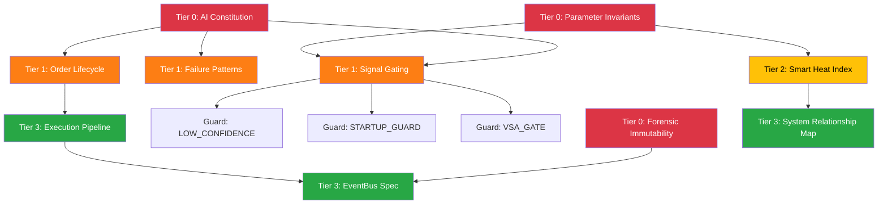

# GOVERNANCE MANIFEST (거버넌스 매니페스트) [V27.0]

> **이 문서는 NoCodeQuant 시스템의 전체 거버넌스 구조를 정의하는 최상위 문서입니다.**
> 모든 문서는 이 매니페스트에 등록되어야 하며, Tier 분류 없이 존재하는 문서는 거버넌스 위반입니다.

---

## 1. Tier 분류 기준 (Impact-Driven Classification)

| Tier | 이름 | 변경 위험도 | 직접 실행 영향 | 최대 손실 영향 | 승인 레벨 | 변경 빈도 |
|------|------|-----------|-------------|-------------|----------|----------|
| **0** | Governance (헌법) | Existential | 없음 (원칙) | 시스템 파괴 | L4 only | Never |
| **1** | Rules (강제 법률) | Direct Capital Loss | High | 실시간 자본 손실 | L3 + 2 reviewers | Quarterly |
| **2** | Policy (적응 정책) | Performance Degradation | Medium | 안전망 내 제한 손실 | L2 + Auto Simulation | Weekly |
| **3** | Architecture (설계 설명) | Knowledge Lag | None | 없음 | L1~L2 | Daily |

---

## 2. 문서 등록부 (Document Registry)

### 🟥 Tier 0 — Governance (절대 불변)

| 문서 | 파일 | 핵심 역할 |
|------|------|----------|
| AI 작업 헌장 | `governance/AI_Work_Constitution_and_Reference_Map.md` | 최상위 거버넌스, 변경 등급 매트릭스 |
| Forensic & DB 불변성 | `governance/Forensic_DB_Immutability_Rule.md` | 과거 데이터 불가침 원칙, EventBus SSoT |
| PnL 금융원장 보호 규칙 | `governance/SSoT-01_Financial_Ledger_Integrity_ko.md` | PnL 금융 데이터 원장 무결성 및 계산 원칙 |

### 🟧 Tier 1 — Rules (강제 규칙)

| 문서 | 파일 | 핵심 역할 |
|------|------|----------|
| 신호 제어 규칙 | `rules/Signal_Gating_Rules.md` | 5단계 결정 게이트, VSA 필터, 데이터 무결성 |
| 실패 패턴 및 방어 | `rules/Failure_Patterns_and_Guards_ko.md` | 알려진 실패 모드 방어 매핑 |
| 주문 생명주기 | `rules/Order_Lifecycle_Spec.md` | 주문 상태 FSM, 안전 가드 |
| 파라미터 불변 조건 | `rules/core/Parameter_Invariants.md` | 핵심 수치 범위 정의, 4-Layer Guard |
| 주도주 필터 규칙 | `rules/market/Market_Leader_Filter.md` | 종목 배제 필터, 건전성 기준 |
| **guards/** | | |
| 저신뢰 가드 | `rules/guards/LOW_CONFIDENCE.md` | 리스크 블록 점수 감계 및 전략 준비 중 상태 전이 근거 |
| 기동 보호 | `rules/guards/STARTUP_GUARD.md` | Warmup Gate 실행 근거 |
| 수급 확증 필터 | `rules/guards/VSA_GATE.md` | VSA 필터 실행 근거 |

### 🟨 Tier 2 — Policy (적응형 정책)

| 문서 | 파일 | 핵심 역할 |
|------|------|----------|
| Smart Heat Index | `policy/Smart_Heat_Index_Spec.md` | 주도주 발굴 엔진 사양 |
| 차단 사유 3계층 체계 | `policy/Reason_Code_Architecture.md` | Reason Code 분류 프레임워크 |
| 감사 수준 운영 표준 | `policy/Audit_Grade_Operational_Standard.md` | 재현성, 포렌식 추적성, Rich Context |

### 🟩 Tier 3 — Architecture (설계 설명)

| 문서 | 파일 | 핵심 역할 |
|------|------|----------|
| 시스템 연결성 지도 | `architecture/L4_System_Relationship_Map_ko.md` | 5개 Theme 연결 구조 |
| 의사결정 흐름 | `architecture/Decision_Flow_Architecture.md` | Indicator-to-Signal 파이프라인 |
| 실행 파이프라인 | `architecture/Execution_Pipeline_Architecture.md` | ExecutionManager SSoT 아키텍처 |
| EventBus & 영속화 | `architecture/EventBus_Persistence_Spec.md` | 감사 추적 인프라 |
| 진입점 | `architecture/Entry_Points.md` | Boot Sequence, Service Managers |
| 시각화 엔진 | `architecture/Visualization_Engine_Spec.md` | Reducer 패턴, 좌표계 불변성 |
| 시각화 엔진 (KO) | `architecture/Visualization_Engine_Spec_ko.md` | 시각화 엔진 한국어 |
| 대시보드 UX 불변 조건 | `architecture/Dashboard_UX_Invariants.md` | UI 색상 체계, 시간축 무결성, 인지 부하 |
| 프로젝트 구조 맵 | `architecture/Project_Structure_Map_ko.md` | 전역 프로젝트 디렉토리 트리 및 접근 권한 가이드 |

### 🟦 Tier 4 — Design & Operations Docs (설계 및 워크로그 - `docs/` 하위)

| 문서 | 파일 | 핵심 역할 |
|------|------|----------|
| V27 설계 노트 | `docs/design_notes/Design_Note_V27_Dock_Decoupling_and_Lifecycle_Integration_ko.md` | QDockWidget 독립 및 라이프사이클 관리 설계 사양 |
| 일일 워크로그 | `docs/daily_logs/2026/05/2026-05-25_Work_Log_ko.md` | V27.0 및 SSoT 매칭을 포함한 일일 변경 내역 기록 |

---

## 3. 의존성 그래프 (Dependency Graph)

---

## 4. Enforcement Roadmap (Enforcement 현황)

> 현재 상태: Phase 1~4 완료 (구조 설계 + 물리적 분리 + 린트 테스트 도입).
> 아래는 Phase 5로, **별도 세션에서 단계적 구축 예정**.

### Phase 4: Enforcement Layer [COMPLETED V26.6]
- [x] CI/Test determinism-validator (`tests/test_determinism_lint.py`) — 비결정성 Wall Clock 호출 자동 검출 린트 도입 완료
- [ ] Git pre-commit hook (`tier-validator.sh`) — Tier 위반 커밋 차단
- [ ] CI governance-validator (Python) — Meta Header 파싱, path/tier 일치 확인
- [ ] Checksum Lock — Tier 0 문서 SHA256 해시 고정

### Phase 5: Self-Governance Automation
- [ ] Simulation Gate — Tier 2 변경 시 자동 백테스트 (6개월 + MonteCarlo 3 regime)
- [ ] Regression Budget — `max_drawdown_increase ≤ 1.2%`, `trade_frequency_delta ≤ 8%`
- [ ] Drift Monitor — Live vs Backtest divergence 30일 rolling 감시
- [ ] LLM 정책 제안 → Simulation → L2 승인 워크플로우

---

## 6. 아카이브 (Archive)

`_archive/kodex_legacy/` 폴더에 초기 `KevinCY-Kodex` 범용 설계 문서 8개가 보존되어 있다.
이 문서들은 NCQ 엔진 실행에 영향을 주지 않으며, **거버넌스 등록부에 포함되지 않는다**.
향후 플랫폼 확장(LLM Governance, RAG, Testing 제도화 등) 시 참고 자산으로 활용 가능하다.

| 문서 | 원래 역할 |
|:-----|:---------|
| `rules.md` | 범용 마스터 룰 (§11 NCQ 흡수 완료) |
| `Architecture.md` | FastAPI+LangGraph 아키텍처 |
| `Code_Style.md` | Python/FastAPI 코딩 표준 |
| `Deployment_CICD.md` | Docker/GitHub Actions CI/CD |
| `Folder_Standards.md` | FastAPI Clean Architecture 폴더 |
| `Prompt.md` | 범용 프롬프트 라이브러리 |
| `RAG.md` | BM25+Dense RAG 파이프라인 |
| `Testing_Strategy.md` | FastAPI/AI 테스팅 전략 |

---
*Manifest Version: v27.0 | Updated: 2026-05-25 | Aligned with Engine V27.0 + Constitution v1.8*
