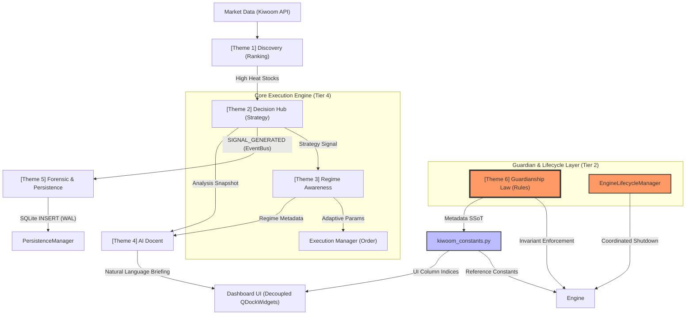

# L4 System Relationship Map (시스템 로직 연결성 지도) [V27.0]

## 1. 개요 (Overview)
본 문서는 NoCodeQuant V27.0 시스템 내의 다양한 기능 테마들이 서로 어떻게 연결되어 하나의 통합된 전략적 결정을 내리는지 정의합니다. 특히 V27.0에서 강화된 **'독립식 독(Dock) 리팩토링'**과 **'라이프사이클 가드'**는 데이터 시각화의 유연성을 제공함과 동시에 비정상 종료 시에도 원장 무결성을 지키는 핵심 기제로 작용합니다.

---

## 2. 테마별 핵심 로직 (Core Themes)

### Theme 1: 시장 주도주 탐색 (Market Leader Discovery)
- **목적**: 전 종목 중 현재 가장 '돈과 관심'이 쏠리는 종목을 실시간으로 발굴.
- **핵심 모듈**: `app/services/managers/ranking_manager.py` (`RankingManager`)
- **로직**: `거래대금(40%) + 모멘텀(30%) + 가속도(20%) + 체결강도/Power(10%)`를 결합하여 **Smart Heat Index** 산출.
- **연결고리**: 이 과정을 통과한 상위 종목만이 **Theme 2(의사결정 허브)**의 정밀 분석 대상이 됨. 실시간 탭 노출 내역은 1분 주기로 스냅샷 파일(`logs/ranking_snapshots_*.jsonl`)에 영속 아카이빙됨.

### Theme 2: 전략 의사결정 허브 (Decision Hub)
- **목적**: 발굴된 주도주를 대상으로 통계적 우위가 있는 진입 타점을 포착.
- **핵심 모듈**: `app/ai/strategy.py` (`StrategyManager.get_signal`) 및 하위 `_engine_entry.py` / `_engine_penalty.py`
- **로직**: `지표 정규화(Tanh) -> 신뢰도 결합(Strength/Stability) -> VSA 수급 확증` 파이프라인.
- **연결고리**: 결정된 신호(BUY/SELL/HOLD)는 **Theme 4(AI 도슨트)**로 전달되어 분석보고가 매핑되고, **Theme 5(포렌식)**에 기록됨.

### Theme 3: 지능형 국면 분석 (Regime Awareness)
- **목적**: 현재 시장이 '추세'인지 '박스'인지 판단하여 매매의 색깔을 결정.
- **핵심 모듈**: `app/ai/strategy.py` (`StrategyManager._update_regime_state`)
- **로직**: `ADX 히스테리시스(22-25) + 3-bar 쿨다운`을 통한 국면 판정.
- **연결고리**: 판정된 국면 정보는 오픈된 포지션의 **Dynamic Exit 전략**을 수정하며, UI의 **Theme Flow Monitor** 및 **보유잔고 감시 패널**에 표시됨.

### Theme 4: AI 도슨트 종합 분석 (AI Docent Insights)
- **목적**: 기계적인 데이터(점수, 아이콘)를 인간이 이해할 수 있는 전략적 시나리오로 변환.
- **핵심 모듈**: `app/ai/ai_utils.py` (GPT-4o Integration)
- **로직**: `Feature Enrichment (RSI Trend, MA Gap, Vol Ratio)` 데이터를 기반으로 전문가 페르소나 분석.
- **연결고리**: 대시보드의 **결정 박스(🐻/⚠️)**와 연동되어 시스템의 '최종 브리핑' 역할을 수행.

### Theme 5: 포렌식 감사 및 영속화 (Forensic & Persistence)
- **목적**: 모든 매매 신호, 주문, 체결 이벤트를 불변의 감사 기록으로 영속화하고 실시간 엔진 텔레메트리 모니터링 수행.
- **핵심 모듈**: `app/services/managers/persistence_manager.py` (SSoT 영속화)
- **로직**: 
  - Engine이 발생시킨 이벤트를 **EventBus를 통해 구독** -> `PersistenceManager`가 SQLite(WAL 모드)에 불변 기록으로 저장.
  - **Flight Recorder**: 2000건의 최근 이벤트를 순환 버퍼(deque)에 관리하고 강제 종료 시 디스크 덤프를 생성.
  - **Metrics Tracing**: DB 대기열(`queue_depth`), API 지연, 루프 지연 등 6대 핵심 병목 지표 실시간 수집.
- **연결고리**: 모든 의사결정 결과가 자동으로 기록되며, UI는 조회 권한만 가짐으로써 데이터 오염 방지.

### Theme 6: 라이프사이클 관리 및 가디언십 (Lifecycle & Guardianship)
- **목적**: 시스템 불변성(Invariant) 보호 및 안정적이고 통제된 셧다운 보장.
- **핵심 모듈**: 
  - `app/services/managers/lifecycle_manager.py` (`EngineLifecycleManager`)
  - `Antigravity_rules/rules/Order_Identity_and_Idempotency_Standards_ko.md`
- **로직**: 
  - `EngineLifecycleManager`가 종료 시그널 수신 시 스레드를 안전하게 수집하고, DB 커밋 완료를 검증하는 Coordinated Shutdown 라이프사이클을 보장함.
  - 최상단 규칙(Rule)이 하부 구현체의 동작 범위를 규제하고 멱등성(Idempotency)을 보장하는 가디언십 루프 작동.

---

## 3. 데이터 흐름 및 가디언십 다이어그램 [V27.0]



---

## 4. 유지보수 원칙 (Maintenance Rules)

### 4.1 상호 연결 및 무결성 (Integrity)
1.  **가디언십 우선 (Guardian First)**: 식별자 체계(`order_id`, `fill_id`, `gtid`)를 수정할 경우 반드시 **Theme 6** 가이드라인을 준수해야 함.
2.  **SSoT 경계 존중**: 메타데이터(FID, 컬럼 인덱스)는 반드시 `kiwoom_constants.py`를 통해서만 참조.
3.  **포렌식 보존**: Theme 5(포렌식)의 데이터 무결성은 Theme 6의 멱등성 가드에 의해 보호되며, `EngineLifecycleManager`에 의해 셧다운 시점에 디스크로 플러시되어야 함.

### 4.2 개발 및 운영 (DevOps)
4.  **연결성 유지**: Theme 2(의사결정)를 수정할 때 Theme 4(AI 도슨트)의 프롬프트 일치 여부를 반드시 확인.
5.  **독립성 확보**: 각 Theme 내부 수치는 `ACTIVE_CONFIG`를 통해 공유하여 설정 불일치 방지.
6.  **가독성 우선**: UI 요소 추가 시 항상 이 Relationship Map의 어느 Theme에 속하는지 명시.
7.  **SSoT 경계 준수**: 이벤트 발행은 Engine에서만 수행. UI에서의 `event_bus.publish()` 호출 금지 (헌장 §1.3).
8.  **AI 작업 제약**: 어떤 AI 세션도 Theme 6에서 정의한 불변성(Invariant)을 수석 아키텍트 승인 없이 우회·수정 불가.

---
*Document Version: v27.0 (Aligns with Engine V27.0)* T2 -- "SIGNAL_GENERATED (EventBus)" --> T5["[Theme 5] Forensic & Persistence"]
    T5 -- "SQLite INSERT (WAL)" --> PM["PersistenceManager"]
    
    T2 -- "Analysis Snapshot" --> T4["[Theme 4] AI Docent"]
    T3 -- "Regime Metadata" --> T4
    T4 -- "Natural Language Briefing" --> UI["Dashboard UI"]
    
    %% Implementation Link
    KC -- "Reference Constants" --> Engine
    KC -- "UI Column Indices" --> UI
    
    subgraph "Guardian Layer (Tier 2)"
        GL
    end
    
    subgraph "Core Execution Engine (Tier 4)"
        T2
        T3
        EM
    end
    
    style GL fill:#f96,stroke:#333,stroke-width:4px
    style KC fill:#bbf,stroke:#333,stroke-width:2px
```

---

## 4. 유지보수 원칙 (Maintenance Rules)

### 4.1 상호 연결 및 무결성 (Integrity)
1.  **가디언십 우선 (Guardian First)**: 식별자 체계(`order_id`, `fill_id`, `gtid`)를 수정할 경우 반드시 **Theme 6** 가이드라인을 준수해야 함.
2.  **SSoT 경계 존중**: 메타데이터(FID, 컬럼 인덱스)는 반드시 `kiwoom_constants.py`를 통해서만 참조.
3.  **포렌식 보존**: Theme 5(포렌식)의 데이터 무결성은 Theme 6의 멱등성 가드에 의해 보호됨.

### 4.2 개발 및 운영 (DevOps)
4.  **연결성 유지**: Theme 2(의사결정)를 수정할 때 Theme 4(AI 도슨트)의 프롬프트 일치 여부를 반드시 확인.
5.  **독립성 확보**: 각 Theme 내부 수치는 `ACTIVE_CONFIG`를 통해 공유하여 설정 불일치 방지.
6.  **가독성 우선**: UI 요소 추가 시 항상 이 Relationship Map의 어느 Theme에 속하는지 명시.
7.  **SSoT 경계 준수**: 이벤트 발행은 Engine에서만 수행. UI에서의 `event_bus.publish()` 호출 금지 (헌장 §1.3).
8.  **AI 작업 제약**: 어떤 AI 세션도 Theme 6에서 정의한 불변성(Invariant)을 수석 아키텍트 승인 없이 우회·수정 불가.

---
*Document Version: v3.0 (Aligns with Engine V19.9)*
