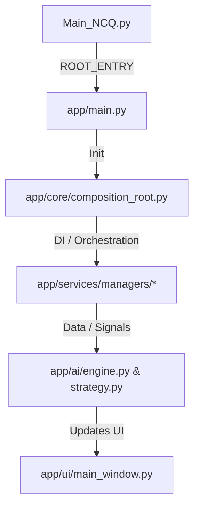

# 전역 프로젝트 구조 맵 (Project Structure Map) [V21.0]

본 문서는 NoCodeQuant 시스템의 전체 디렉토리 구조와 모듈별 역할을 정의합니다.  
**모든 파일 탐색 및 작업은 본 구조 맵을 최우선 기준으로 수행**하며, AI는 보호 구역(Protected Zone)에 대한 수정 권한을 반드시 확인해야 합니다.

---

## 1. 비주얼 트리 (Visual Tree)

### 1.1 실제 폴더 구조 (Actual Tree) — 주요 모듈 및 핵심 파일

```text
nocodequant/
├── Main_NCQ.py              # [ROOT_ENTRY] 시스템 실행 루트 (V15.8 Bridge)
├── app/                     # [Core Application] 클린 아키텍처 기반 핵심 코드
│   ├── main.py              # [ENTRY] 내부 초기화 및 Composition Root 호출
│   ├── ai/                  # [Brain] 전략·엔진·시나리오 분석 (기술적 지표 계산)
│   │   ├── engine.py        # Kiwoom API 전문 처리 및 실시간 데이터 파이프라인
│   │   ├── strategy.py      # [PROTECTED:L4] 전략 오케스트레이터 및 신호 판단 진입점
│   │   ├── _engine_entry.py # [L4_CORE] 신규 진입 판단 및 L3 가드 엔진
│   │   ├── _engine_exit.py  # [L4_CORE] 비대칭 출구(SL/TP/Time) 청산 엔진
│   │   ├── _engine_penalty.py # [L4_CORE] 패널티 계산 및 로직 갭 분석 엔진
│   │   ├── reasoning_cache.py # [Brain] AI 기술적 패턴 벡터 추론 캐시
│   │   └── ai_utils.py      # AI 도슨트 연동 및 분석 프롬프트 관리
│   ├── core/                # [Core System] 시스템 공통 기능 및 런타임 환경
│   │   ├── async_runtime.py # 비동기 루프 및 스케줄링 관리
│   │   ├── composition_root.py # 전역 서비스 오케스트레이션 및 DI 구성
│   │   ├── config_engine.py # 시스템 설정 로드 및 검증 엔진
│   │   ├── engine_fsm.py    # 엔진 상태 제어 유한 상태 머신
│   │   ├── engine_monitor.py # 실시간 엔진 상태 모니터링 및 텔레메트리
│   │   ├── event_bus.py     # 내부 컴포넌트 간 비동기 이벤트 중계
│   │   ├── events.py        # 시스템 정의 이벤트 클래스 목록
│   │   ├── executor.py      # 비동기 태스크 실행기
│   │   ├── market_policy.py # 시장 대응 정책 및 마켓 세션 관리
│   │   ├── money_manager.py # 자금 관리 및 배팅 사이즈 정책
│   │   ├── parameter_autotuner.py # 전략 파라미터 최적화 및 튜닝
│   │   ├── replay_context.py # 리플레이 모드용 컨텍스트 정보
│   │   └── runtime_config.py # 런타임 시 변동되는 설정 관리
│   ├── services/            # [Domain Services] 비즈니스 로직 처리 계층
│   │   ├── tuning/          # [Tuning] AI 자율 파라미터 튜닝, 상태 관측 및 롤백 엔진
│   │   │   └── coordinator.py # [PROTECTED:L4] 진단 → 튜닝 반영 및 상태 관리 SSoT
│   │   ├── managers/        # [Execution] 실행 및 자원 관리 (매니저 그룹)
│   │   │   ├── execution_manager.py # [PROTECTED:L4] 주문 실행 및 스케줄링 핵심
│   │   │   ├── krx_authority.py     # [V23.5] KRX 업종/신뢰도 데이터 병합 레이어
│   │   │   ├── krx_etf_pipeline.py  # [V23.5] ETF 구성 종목 기반 테마 보강 파이프라인
│   │   │   ├── lifecycle_manager.py # [V26.2.2] Coordinated Shutdown 및 라이프사이클 관리
│   │   │   ├── market_data_manager.py # 실시간 데이터 수집 및 관리
│   │   │   ├── order_manager.py     # [PROTECTED:L4] 주문 집행 및 자율 튜닝 통합
│   │   │   ├── persistence_manager.py # [PROTECTED:L4] SQLite 영속화 및 포렌식 기록
│   │   │   ├── policy_engine.py      # [PROTECTED:L4] Signal Gating 및 리스크 정책
│   │   │   ├── ranking_manager.py   # 주도주 탐색 및 Smart Heat Index 계산
│   │   │   ├── stock_graph_manager.py # [V23.5] 종목-업종-테마 GraphRAG 엔진
│   │   │   ├── schema.py            # 데이터베이스 테이블 스키마 정의
│   │   │   ├── schema_views.py      # [SSoT:Analytics] 성과 분석용 SQL 뷰 및 통계 쿼리 격리 정의
│   │   │   ├── state_manager.py     # 앱 전역 상태 및 마켓 국면 관리
│   │   │   └── utils.py             # 매니저 공통 유틸리티
│   │   ├── interfaces.py    # 서비스 레이어 공통 인터페이스 규격
│   │   └── surveillance.py  # 시장 감시 및 이상 징후 탐지
│   ├── ui/                  # [Presentation] 사용자 인터페이스 (표현층)
│   │   ├── main_window.py   # [UI_ENTRY] 메인 윈도우 레이아웃 및 컨트롤러
│   │   ├── builders/        # [Builders] UI 조립 및 레이아웃 빌더 (L4 Decoupled)
│   │   ├── managers/        # [UI_Managers] UI 전용 제어 및 설정 매니저
│   │   │   ├── config_manager.py # UI 설정 로딩/저장 및 상태 복구 전담
│   │   │   ├── hud_manager.py   # [V27.0] 실시간 전술 HUD 갱신 및 연산 관리자
│   │   │   ├── poe_health_panel.py # POE 상태/건강 지표 및 튜닝 패널 위임
│   │   │   └── replay_controller.py # 리플레이 모드 전환 및 UI 제어 (Step 4A)

│   │   ├── strategy_dashboard.py # [UI_SHELL] KPI 패널 및 탭 오케스트레이터
│   │   ├── forensic_dashboard.py # 전역 이벤트 및 감사 로그 대시보드
│   │   ├── dashboard/           # [Dashboard_Components] 기능별 독립 탭 위젯
│   │   │   ├── overview_tab.py  # 전략 성과 요약 테이블
│   │   │   ├── trade_log_tab.py # 상세 거래 내역 및 테이블 모델
│   │   │   └── ai_tuning_tab.py # AI 진단 엔진 및 튜닝 인터랙션
│   │   ├── base.py          # UI 위젯 공통 베이스 클래스
│   │   ├── components/      # [Components] 고수준 복합 컴포넌트
│   │   │   ├── active_signal_popup.py # 실시간 신호 알림 팝업
│   │   │   └── position_dashboard.py  # 하단 포지션 현황판 브릿지
│   │   ├── dialogs/         # [Dialogs] 사용자 입력 및 설정 대화상자
│   │   │   ├── license_dialog.py      # 라이선스 및 시스템 정보
│   │   │   ├── stock_search_dialog.py # 종목 탐색 및 선택
│   │   │   ├── strategy_settings_dialog.py # [V27.0] 하이브리드 전략 설정 팝업창
│   │   │   └── trading_scope_dialog.py # 매매 범위 및 필터 설정
│   │   └── widgets/         # [Widgets] 독립형 UI 요소 및 차트 위젯
│   │       ├── advanced_chart.py      # 분석용 고성능 캔들 차트
│   │       ├── performance_summary.py # KPI 요약 카드 위젯
│   │       ├── premium_header_widget.py # 상단 프리미엄 상태바
│   │       ├── range_calendar.py      # 기간 선택 잭 캘린더
│   │       ├── ranking_widget.py      # 주도주 순위 리스트
│   │       ├── recommendation_widget.py # AI 추천 시나리오 요약
│   │       ├── signal_status_widget.py # 실시간 신호 상태 모니터
│   │       ├── tactical_hud_widget.py # [V27.0] 실시간 전술 HUD 모니터 위젯
│   │       └── theme_flow_widget.py   # [V27.0] 실시간 주도테마 흐름 모니터 위젯

│   └── utils/               # [Utility] 공통 유틸리티 및 상수 관리
│       ├── candle_manager.py # 캔들 데이터 처리 및 관리
│       ├── colors.py        # UI 전용 색상 테마 상수
│       ├── kiwoom_constants.py # [PROTECTED:L4] 키움 FID 및 SSoT
│       └── utils.py         # 범용 문자열/시간 처리 유틸리티
├── Antigravity_rules/       # [Governance] 최상위 거버넌스 및 규칙 (통제층)
│   ├── architecture/        # 시스템 지도 및 설계 사양서 (본 문서 포함)
│   ├── governance/          # AI 작업 헌장 및 참조 맵
│   └── rules/               # 데이터 무결성 및 매매 제어 규칙
├── docs/                    # [Docs] 문서화 (일일 워크로그, 설계 노트)
├── data/                    # [Data] SQLite DB 및 정적 데이터 (krx_master.json 포함)
├── tests/                   # [Tests] 테스트 스위트 (유닛 및 통합 테스트)
│   ├── test_determinism_lint.py # [V26.6] AST determinism lint 테스트
│   ├── test_logic_improvements.py # [V23.X] 감시 및 스케줄러 기능 검증 테스트
│   └── test_pnl_ssot_consistency.py # PnL 정합성 및 무결성 검증 테스트
└── logs/                    # [Logs] 런타임 디버그 및 실행 로그
```

---

## 2. 도메인별 역할 및 접근 권한 (Domain Guide)

| 도메인 경로 | 역할 정의 (Role) | 권한 등급 |
| :--- | :--- | :---: |
| `app/ai/` | 전략 생성 및 신호 판단의 단일 진입 도메인 (Brain) | Standard |
| `app/core/` | 시스템 런타임, 이벤트 전송 및 오케스트레이션 수행 | Standard |
| `app/services/` | 비즈니스 로직 실행 및 주문·영속화 담당 (Execution) | Mixed (Standard+Protected) |
| `app/services/tuning/` | 자율 파라미터 튜닝, 실시간 상태 관측 및 롤백 이력 관리 | Protected |
| `app/ui/` | 데이터 시각화 및 사용자 인터랙션 처리 (Presentation) | Standard |
| `Antigravity_rules/` | 시스템 불변성(Invariant) 및 거버넌스 규칙 정의 | Protected |

---

## 3. 핵심 진입점 및 네비게이션 가이드 (Navigation Guide)

### 3.1 상황별 최우선 확인 파일 (Problem-to-File Mapping)
AI는 탐색 시 아래 시나리오를 참고하여 가장 먼저 해당 파일을 확인한다.

- **매매 판정 및 로직 수정 시**: `app/ai/strategy.py` (및 하위 `_engine_*.py` 엔진 그룹)
- **데이터 분석 및 API 이슈 발생 시**: `app/ai/engine.py`
- **시스템 초기화 및 DI 흐름 파악 시**: `app/core/composition_root.py`
- **주문 집행 및 체결 로그 확인 시**: `app/services/managers/order_manager.py`
- **시스템 설정 수정 및 로드 이슈 발생 시**: `app/core/config_engine.py`
- **UI 레이아웃 및 컨트롤러 수정 시**: `app/ui/main_window.py`

### 3.2 AI 탐색 프로토콜 (Navigation Protocol)
AI는 파일 탐색 시 아래 순서를 반드시 따른다:
1. 본 구조 맵(Project_Structure_Map_ko.md)을 최우선적으로 확인하여 보호 구역 확인.
2. 위 상향식 네비게이션 가이드를 통해 관련 핵심 파일로 즉시 이동.
3. 대상 디렉토리 내부에서 상세 파일 탐색 및 구조 로드.
*임의 경로 추측을 금지한다. 실제 파일 시스템과 본 맵 간 불정합이 발견되면 즉시 맵 업데이트(L3 이상)를 우선 수행한다.*

---

## 4. 시스템 실행 흐름 (Execution Flow)



---

## 5. 보호 구역 (Protected Zone)

### 5.0 보호 구역 지정 기준 (Protected Zone Criteria)
다음 조건 중 하나 이상을 만족하는 모듈은 Protected로 지정된다:
- 시스템의 금전적 결과(주문, 체결)에 직접 영향을 미치는 경우
- 리스크 제어 또는 매매 정책을 결정하는 경우
- 데이터 무결성 또는 포렌식 기록을 담당하는 경우
- 시스템 전반에서 참조되는 SSoT(Single Source of Truth)인 경우

### 5.1 보호 구역 목록
- **app/services/managers/policy_engine.py [PROTECTED:L4]**
- **app/services/managers/execution_manager.py [PROTECTED:L4]**
- **app/services/managers/order_manager.py [PROTECTED:L4]**
- **app/services/managers/persistence_manager.py [PROTECTED:L4]** — [SSoT-01_금융원장보호]
- **app/ai/strategy.py [PROTECTED:L4]** — [GUARD LOGIC-01~03]
- **app/utils/kiwoom_constants.py [PROTECTED:L4]**
- **app/services/tuning/coordinator.py [PROTECTED:L4]**
- **docs/architecture/market_regime_definition_ko.md [PROTECTED:L4]** — [GUARD LOGIC-01]
- **docs/architecture/strategy_classification_ko.md [PROTECTED:L4]** — [GUARD LOGIC-02]
- **[Rule: SSoT-01] Financial Ledger Integrity** — PnL 산출 로직(Ledger-based) 보호 구역
- **[Rule: LOGIC-01~03] Strategy Logic Integrity** — 시장 국면, 전략 분류, 매도 로직 무결성 보호 구역

---

> [!IMPORTANT]
> **탐색 및 수정 규칙**
> 1. 모든 파일 탐색은 본 구조 맵을 최우선 기준으로 수행한다.
> 2. **보호 구역(Protected Zone) 권한 분리**:
>    - **읽기(Read)**: 모든 AI에게 완전 자유 (분석 및 참조 데드락 방지)
>    - **수정(Write)**: 반드시 **[L4_승인요청]** 필요 (수정 원인 및 임팩트 보고 필수)
> 3. **구조 맵과 실제 파일 시스템 간 충돌 발생 시**:
>    - **실제 파일 시스템을 1차 진실(Source of Truth)**로 간주한다.
>    - 구조 맵은 **즉시 업데이트 대상(L3 이상)**으로 승격한다.
>    - AI는 충돌 상태에서 임의의 수정·삭제·리팩토링을 수행하지 않고 보고한다.

---
*Document Version: v27.0 (Aligns with AI Constitution v1.8)*
*Last Updated: 2026.05.25 (V27.0 Sync)*
