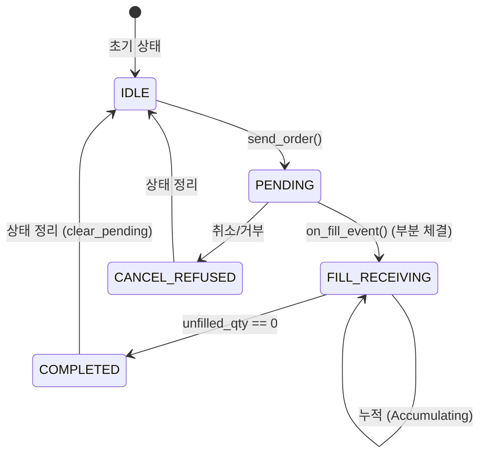

# Order Lifecycle Specification (주문 생명주기 사양서) [V27.0]

## 1. 개요 (Overview)
`OrderManager`는 **주문 생성, 실행, 체결 확인**의 전 과정을 관리하며, 중복 주문 방지와 포지션 무결성을 보장하는 실행 레이어 컴포넌트입니다.

- **위치**: `app/services/managers/order_manager.py`
- **등급**: **L3** (실행부 로직)
- **의존성**: `IEngine` (KiwoomEngine/MockEngine), `IStateManager`, `PersistenceManager`, `MoneyManager`

---

## 2. 주문 상태 전이 (Order State Machine)

---

## 3. 안전 가드 (Safety Guards)

### 3.1 Pre-Order Gates (`check_ready`)

| Gate | Condition | Action |
| :--- | :--- | :--- |
| **Dedup Guard** | `(code, qty, side)` 해시가 캐시에 존재 (30s TTL) | 주문 차단 |
| **Cooldown Gate** | 직전 주문 후 `cooldown_sec`(5초) 미만 | 주문 차단 |
| **Pending Guard** | 해당 종목에 미체결 주문 존재 | 주문 차단 |
| **Pending Timeout Guard [V20.9.3]** | Pending 상태 등록 후 `PENDING_TIMEOUT_SEC`(30초) 경과 | Pending 강제 해제 및 다음 주문 허용 |
| **Inventory Guard (SELL)** | 포지션 수량 = 0 | 매도 주문 차단 |
| **Inventory Guard (BUY)** | 이미 보유 중 (qty > 0) | 매수 주문 차단 |

### 3.2 Post-Order Processing

1. **Pending Set 등록**: `pending_orders.add(code)` 및 `pending_order_times[code]` 등록 (Timeout Guard용).
2. **Metadata Caching**: `pending_signal_meta[code]`에 전략명, 국면, 손절가 등 저장.
3. **Metadata Disk Persistence [V23.7]**: 앱 재기동 시 복원 가능하도록 `data/pending_meta.json` 파일에 영속화.
4. **GTID 매핑**: `pending_gtid_map[code] = signal.gtid` — 체결 시 부모 GTID 추적.
5. **Last Order Time**: 쿨다운 타이머 갱신.

---

## 4. 체결 처리 (`on_fill_event`) [V27.0]

체결 확인 시 다음의 원자적 처리를 수행합니다:

1. **Idempotency Guard (멱등성 검사)**: 
    - **통합 식별자 사용**: `fill_id = f"{base_id}_{unfilled_qty}"` (FID 912_FID 902).
    - **모의투자 대응**: 부분 체결 시 체결번호(FID 912)가 고정되더라도 미체결 수량 변화를 통해 고유성 확보.
    - `processed_fills` 단일 캐시 필터를 통해 중복 체결 중복 연산 방지 (1000건 초과 시 자동 가비지 컬렉션).
2. **Metadata Restore**: `pending_signal_meta` 또는 `StateManager`로부터 진입 메타데이터 복원.
    - `entry_time` 복원 시 `None` 또는 `'-'`일 경우 방어 로직 가동하여 지표 계산 크래시 방지.
    - **Crash Recovery Fallback [V23.7]**: 앱 비정상 종료 후 재기동 시 `pending_signal_meta`가 비어있다면 `StateManager`의 `position_meta`에서 최소 정보를 복원.
3. **State Update**: `StateManager.update_position_on_fill()` — 포지션 및 PnL 갱신.
4. **Partial Fill Accumulation**: `fill_accumulator`를 통한 부분 체결 누적 및 평단가(VWAP) 산출.
    - **분할 매도 acc 재활용 [V20.9.5]**: 매도(SELL) 체결 시 parent_gtid 무관하게 동일 종목의 기존 매도 acc를 무조건 재활용하여 단일 GTID로 수렴시킴.
5. **VWAP Sanity Guard [V23.3]**: 청산 평균가가 진입가 대비 50% 이상 괴리 시 최신 호가 또는 진입가로 보정하여 키움 체결가 오염 방어.
6. **MME Heat Update**: BUY 체결 완료 시 실제 평단가/총자산 기반으로 리스크 노출량(Heat) 관리.
7. **Forensic Event 발행**: `unfilled_qty == 0` 시점에 `PersistenceEvent(FILL, ...)` 발행.
8. **Pending 해제**: `clear_pending(code, clear_meta=True)` — 다음 주문 허용 및 메모리 정리.
9. **Shutdown Auto-Flush [V20.9.2]**: 앱 정상 종료 시 미완료된 SELL 누적기를 강제 플러시(`flush_sell_accumulators`)하여 DB 유실을 차단.

---

## 5. SSoT 규칙

- **주문 실행**: `OrderManager.send_order()`가 유일한 주문 실행 경로.
- **체결 확인**: `OrderManager.on_fill_event()`가 유일한 체결 확인 경로.
- **포지션 갱신**: 반드시 `StateManager.update_position_on_fill()`을 통해서만 수행.
- **UI에서의 직접 주문 금지**: 모든 주문은 `ExecutionManager` → `OrderManager.send_order` 경로를 통해서만 허용. (수동 매도 제외)

---
*Document Version: v27.0 (Aligns with Engine V27.0)*
