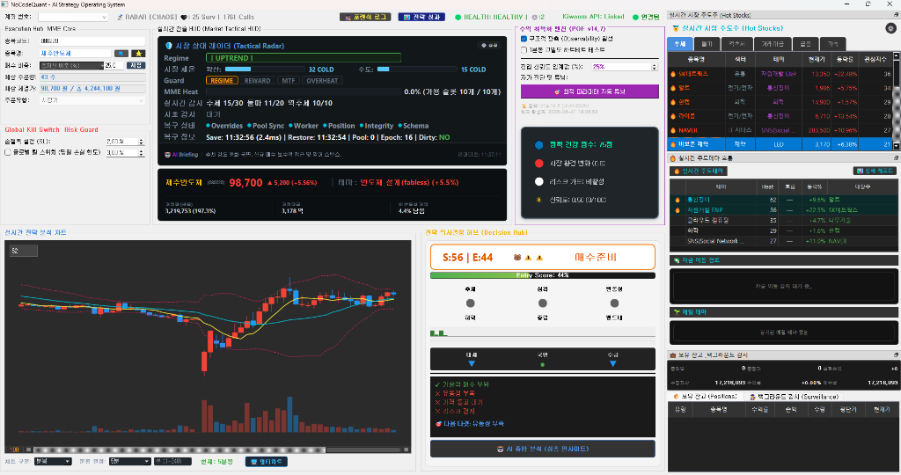
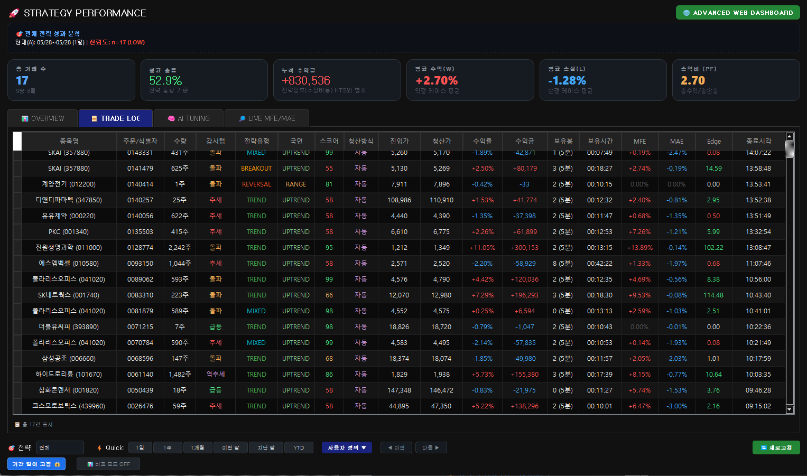
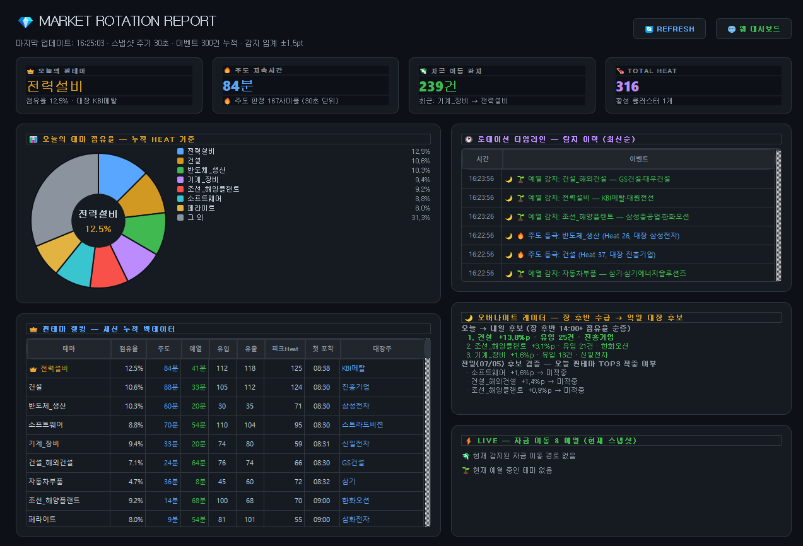

# 📖 NoCodeQuant Open (AI Strategy Docs & Reports) - Public Repository

> **NoCodeQuant Open**은 AI 주도 정밀 규격 트레이딩 시스템 NoCodeQuant의 **기획서, 시스템 아키텍처, 백테스팅 성과 리포트, 그리고 데일리 개발 일지**를 기록하고 투명하게 공유하기 위한 **공개 문서 저장소**입니다.

---

## 🎯 저장소 운영 목적 및 보안 정책 (Security Policy)

본 저장소는 시스템의 설계 사상과 튜닝 과정의 투명한 기록을 보존하기 위해 운영되며, 핵심 지적재산권과 실자산 보안을 위해 다음 정책을 엄격히 적용합니다.

1. **소스코드 완전 배제 (No Execution Code)**:
   * 매매 판단 알고리즘, 리스크 가드 제어, UI 렌더링을 위한 파이썬(`.py`) 코드는 물론이며 프론트엔드/백엔드 실행을 위한 어떠한 코드도 본 퍼블릭 레포지토리에 업로드되지 않습니다.
2. **실거래 데이터 및 비밀키 원천 격리**:
   * 로컬 시뮬레이션 및 실거래 내역이 적재된 데이터베이스 파일(`.db`)과 API 키, 계좌 비밀번호, 환경 변수 파일(`.env` 등) 일체는 업로드 대상에서 원천 배제됩니다.
3. **오픈 아키텍처 및 연구 자료 공유**:
   * 트레이딩 시스템의 구조(MME Core, POE 등)와 특정 장세에 대응하기 위한 수급 가드 시뮬레이션 데이터 등 순수 기획/분석용 학술 문서만 공유됩니다.

---

## 📁 주요 문서 구조 (Directory Guide)

저장소 내 문서는 다음과 같은 분류 규칙에 따라 체계적으로 누적 관리됩니다.

### 1. [docs/daily_logs/](docs/daily_logs/) (데일리 작업 일지)
* 시스템의 일일 버그 패치 내역, 최적 파라미터 적용 지표, 청소 작업 및 헌장 개정 히스토리가 연도/월별로 기록됩니다.
* 실거래 세션에서 발견된 정밀 오류의 원인 추적과 해결 과정이 투명하게 명세됩니다.

### 2. [docs/design/](docs/design/) & [docs/architecture/](docs/architecture/) (설계 및 아키텍처 사양서)
* **이중 체온 가드 시스템 설계**: 시장 참여도와 주도주 쏠림 현상을 읽기 위한 이중 수급 온도 계산 알고리즘 사양.
* **시초 회복 감시(Opening Recovery) 아키텍처**: 09:00~09:05 사이 차단된 신호의 당일 고가 재돌파 수급을 검출하는 상태 기계 전이 규칙서.
* **Stop Loss & Doomsday SL**: 포지션별 1초 주기 리스크 모니터링 및 자산 보호 스톱 아키텍처 명세서.

### 3. [docs/analysis/](docs/analysis/) (성과 분석 및 파라미터 스윕)
* 시장 Regime별 백테스팅 벤치마크 성과 비교 레포트.
* 아침 1.5배 동적 수급 가드(시나리오 F) 적용에 따른 누적 손익 향상 실측 데이터.

### 4. [Antigravity_rules/](Antigravity_rules/) (AI 거버넌스 및 규칙)
* 시스템 내에서 수행되는 모든 튜닝 및 코드 변경에 대해 AI가 지켜야 할 기술 부채 제로 원칙, 불변성(Invariant) 가드, 변경 승인 등급(L1~L4)을 포함한 핵심 거버넌스 규칙셋입니다.

---

## 💡 연구 참여 및 피드백
NoCodeQuant 시스템의 구조 분석서 및 백테스트 벤치마크 데이터를 통해 알고리즘 트레이딩 아키텍처 설계에 기여하고자 합니다. 문서상의 질문이나 피드백은 Issue 탭을 통해 언제든 공유해 주시기 바랍니다.
